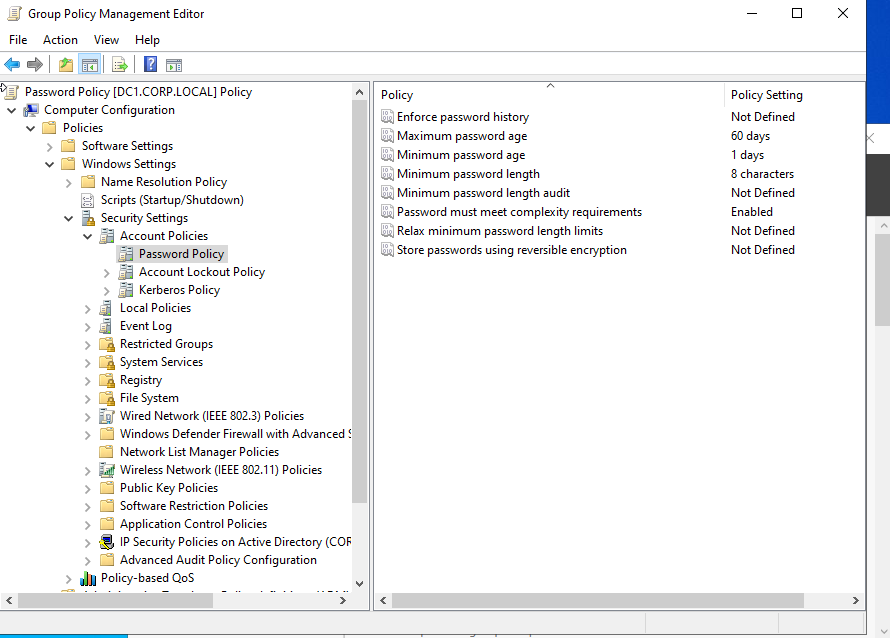
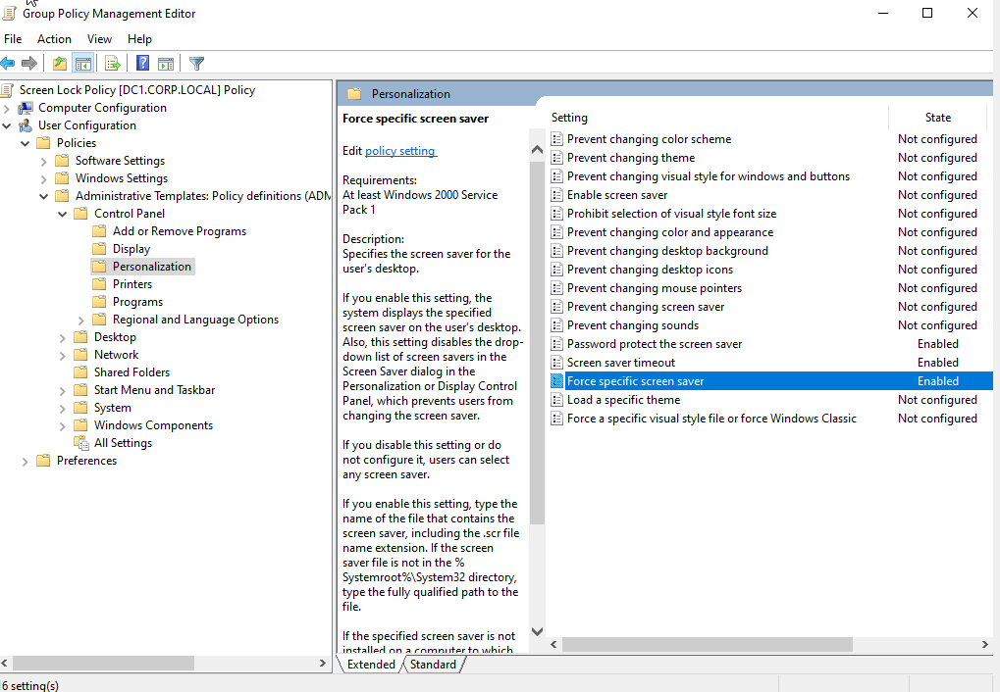
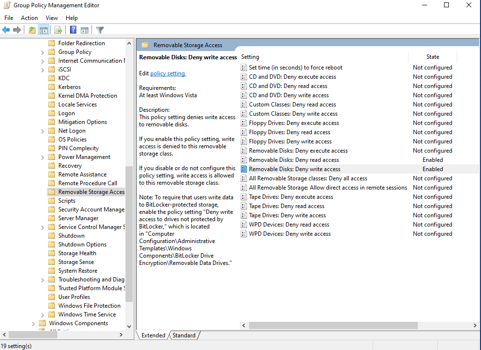
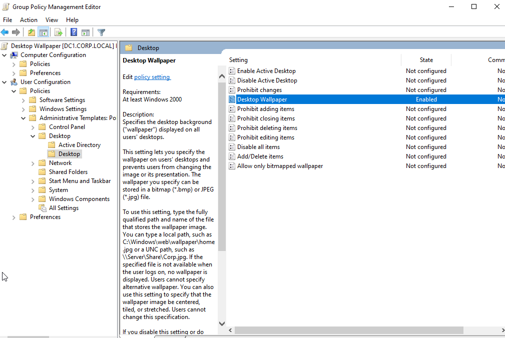
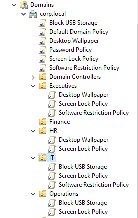
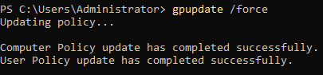
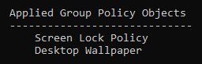

# Active Directory Home Lab — Setup Guide (Day 1)

## Overview

This document explains what was completed on Day 1 of setting up the Active Directory home lab. 

---

## What Was Installed

### Virtual Machine Setup

A Windows Server 2022 virtual machine was created in VirtualBox. The machine was configured with the following basic settings:

* 4 GB of RAM
* 2 CPU cores
* 60 GB of storage
* A network adapter using an Internal Network

Windows Server 2022 was installed on this VM, and the Administrator account was used for initial configuration.

### Server Roles

The following Windows Server roles were installed:

* Active Directory Domain Services (AD DS)
* DNS Server

These are the two core components needed for creating and managing a Windows-based domain.

---

## Day 1 Summary

Below is a clear outline of everything completed on the first day.

### 1. Installed Windows Server 2022

* Created the VM in VirtualBox
* Mounted the Windows Server ISO
* Completed the operating system installation
* Signed in as Administrator for the first-time setup

### 2. Configured Static Networking

* Opened the Network Connections panel
* Assigned a static IPv4 address
* Set the DNS server to the server’s own IP
* Verified that the adapter was active and properly configured

A static IP is required so the domain controller does not change addresses when rebooted.

### 3. Installed AD DS and DNS

* Opened Server Manager
* Added the AD DS and DNS roles
* Completed the role installation

### 4. Promoted the Server to a Domain Controller

* Created a new forest
* Specified a domain name
* Allowed the server to restart after domain promotion

After this step, the server became “DC1,” the first domain controller in the environment.

### 5. Took Documentation Screenshots

All required screenshots were captured and stored for uploading to GitHub.

---

## Screenshots

### Server Manager Home


### AD DS Roles Installed


### DNS Server Roles Installed


### DC1 System Information


### Static IP Configuration


---

# Active Directory Home Lab — Setup Guide (Day 2)

## Overview

This document explains what was completed on Day 2 of setting up the Active Directory home lab. Day 2 focused on organizational structure and automated user creation.

---

## What Was Built

### Organizational Unit Structure

A clean, realistic folder structure was created for users, computers, and security groups. Inside Active Directory Users and Computers, the following OU structure was established:

```
corp.local
 └── _CORP
     ├── Groups
     ├── Users
     │     ├── Operations
     │     ├── HR
     │     ├── IT
     │     ├── Finance
     │     └── Sales
     └── Computers
           ├── Workstations
           └── Servers
```

Each OU was created by right-clicking the domain in Active Directory Users and Computers, selecting New → Organizational Unit, and naming it appropriately. This structure provides a logical separation of resources and makes management easier.

### Automated User Creation

A PowerShell automation script was created to bulk-create users in specific OUs. This script reads from a CSV file and automatically provisions users with proper attributes and secure passwords.

---

## Day 2 Summary

Below is a clear outline of everything completed on the second day.

### 1. Created Organizational Unit Structure

* Opened Active Directory Users and Computers
* Created the _CORP parent OU under the domain
* Created Groups, Users, and Computers OUs under _CORP
* Created department-specific OUs under Users (Operations, HR, IT, Finance, Sales)
* Created Workstations and Servers OUs under Computers
* Verified the complete structure was in place

This OU structure provides a realistic organizational layout that mirrors how enterprises typically organize their Active Directory environments.

### 2. Developed User Creation Script

* Developed a PowerShell script `create_users.ps1` to automate user creation
* Set up username generation using first initial and last name format
* Implemented secure password assignment
* Added error handling for failed user creation attempts

The CSV file format used:

```
FirstName,LastName,Department
Laura,Nguyen,Operations
Michael,Adams,Sales
```

### 3. Executed User Creation Script

* Placed the CSV and PowerShell script files in `C:\scripts\`
* Opened PowerShell as Administrator
* Set execution policy to allow script execution
* Ran the script to create all users
* Verified users were created in the correct department OUs

The script successfully created users in their respective department OUs, with each user account enabled and ready for use.

### 4. Verified User Creation

* Opened Active Directory Users and Computers
* Checked each department OU to confirm users were present
* Verified user properties were correctly set
* Confirmed no errors occurred during the creation process

All users were successfully created and placed in their appropriate organizational units.

### 5. Took Documentation Screenshots

All required screenshots were captured and stored for uploading to GitHub.

---

## User Creation Script Details

The PowerShell script `create_users.ps1` performs the following operations:

* Imports the ActiveDirectory module
* Generates usernames using the format: first initial + last name (lowercase)
* Creates the appropriate OU path based on department
* Assigns a secure password to each user
* Creates the AD user account with all required attributes
* Enables the user account immediately
* Logs each created user to the console
* Handles errors gracefully with try-catch blocks

The script was placed in `C:\scripts\` along with the `users.csv` file, and executed with administrator privileges after setting the execution policy.

---

## Screenshots

### OU Structure


### AD Structure Diagram


### OU Users Folders


### User Creation Script Run


### AD Users Populated


### Individual User Properties


---

# Active Directory Home Lab — Setup Guide (Day 3)

## Overview

This document explains what was completed on Day 3 of setting up the Active Directory home lab. Day 3 focused on Group Policy configuration, creating and linking GPOs to enforce security policies and organizational standards across the domain.

---

## What Was Built

### Group Policy Objects (GPOs)

Multiple Group Policy Objects were created to enforce security policies, user experience settings, and organizational standards. These GPOs were linked to appropriate Organizational Units to apply policies to specific groups of users and computers.

The following GPOs were created:

* Password Policy — Enforces strong password requirements at the domain level
* Screen Lock Policy — Automatically locks workstations after user inactivity
* Block USB Storage — Prevents unauthorized use of USB storage devices
* Desktop Wallpaper — Applies a corporate wallpaper to user desktops

---

## Day 3 Summary

Below is a clear outline of everything completed on the third day.

### 1. Opened Group Policy Management Console

* Opened Group Policy Management from the Start Menu
* Navigated to the domain structure
* Prepared to create and manage GPOs

The Group Policy Management Console is the central tool for creating, editing, and linking Group Policy Objects in Active Directory.

### 2. Created Password Policy GPO

* Created a new GPO named "Password Policy"
* Linked it at the domain level (required for account policies)
* Configured minimum password length: 8 characters
* Enabled password complexity requirements
* Set maximum password age: 60 days
* Set minimum password age: 1 day

Password policies must be linked at the domain level because Account Policies only apply at the domain root in Active Directory.

### 3. Created Screen Lock Policy GPO

* Created a new GPO named "Screen Lock Policy"
* Set screen saver timeout: 600 seconds (10 minutes)
* Enabled password protect the screen saver
* Enabled force specific screen saver

This policy ensures workstations automatically lock after 10 minutes of inactivity, protecting against unauthorized access.

### 4. Created Block USB Storage GPO

* Created a new GPO named "Block USB Storage"
* Navigated to Removable Storage Access policies
* Enabled "Removable Disks: Deny read access"
* Enabled "Removable Disks: Deny write access"

This security policy prevents data theft and unauthorized data transfer via USB storage devices.

### 5. Created Desktop Wallpaper GPO

* Created a new GPO named "Desktop Wallpaper"
* Enabled desktop wallpaper policy
* Set wallpaper path: C:\Wallpaper\corpwallpaper.jpg
* Set style: Fill

This optional GPO provides a visual confirmation that Group Policy is working correctly and maintains a consistent corporate appearance.

### 6. Linked GPOs to Organizational Units

* Linked Screen Lock Policy and Block USB Storage to IT OU
* Linked Password Policy to HR OU
* Linked Screen Lock Policy and Password Policy to Operations OU
* Linked Desktop Wallpaper to Executives OU

GPOs were strategically linked to OUs to apply policies where they are most needed. Password Policy was linked at the domain level as required.

### 7. Forced Policy Update

* Ran `gpupdate /force` on the server
* Executed the command to immediately apply all Group Policy changes
* Verified the command completed successfully

The `gpupdate /force` command forces an immediate refresh of all Group Policy settings, bypassing the normal refresh interval.

### 8. Verified Policy Application

* Ran `gpresult /r` to view applied Group Policy Objects
* Verified that all created GPOs were listed in the Applied Group Policy Objects section
* Confirmed policies were successfully applied to the system

This verification step proves that the GPOs are active and being enforced on the domain controller.

### 9. Took Documentation Screenshots

All required screenshots were captured and stored for uploading to GitHub.

---

## Group Policy Configuration Details

The Group Policy Objects created on Day 3 perform the following operations:

* Password Policy GPO enforces strong password requirements including minimum length of 8 characters, complexity requirements, maximum age of 60 days, and minimum age of 1 day
* Screen Lock Policy GPO configures automatic workstation lock after 10 minutes of inactivity with password protection
* Block USB Storage GPO prevents read and write access to removable disk devices
* Desktop Wallpaper GPO applies a corporate wallpaper image to user desktops for consistent branding

Password Policy must be linked at the domain level, as Account Policies can only be applied at the domain root in Active Directory. The other GPOs were linked to specific Organizational Units to apply policies where they are most needed.

---

## Screenshots

### Password Policy GPO



### Screen Lock Policy



### Block USB Storage GPO



### Desktop Wallpaper GPO



### Linked GPOs to OUs



### GPUpdate Output



### Applied Group Policy Objects




