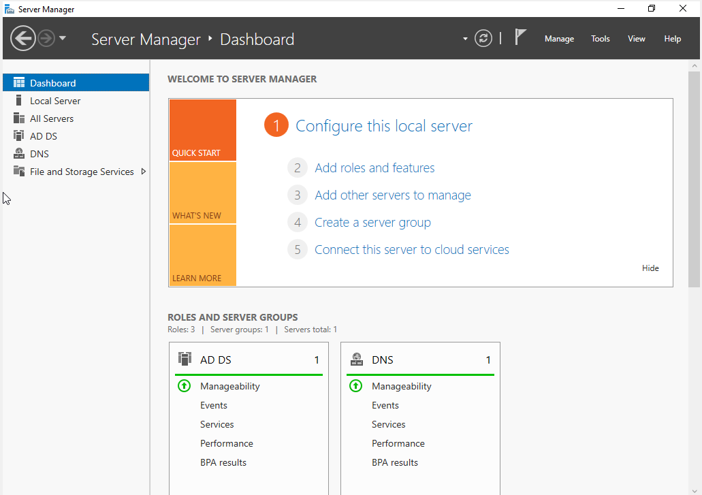
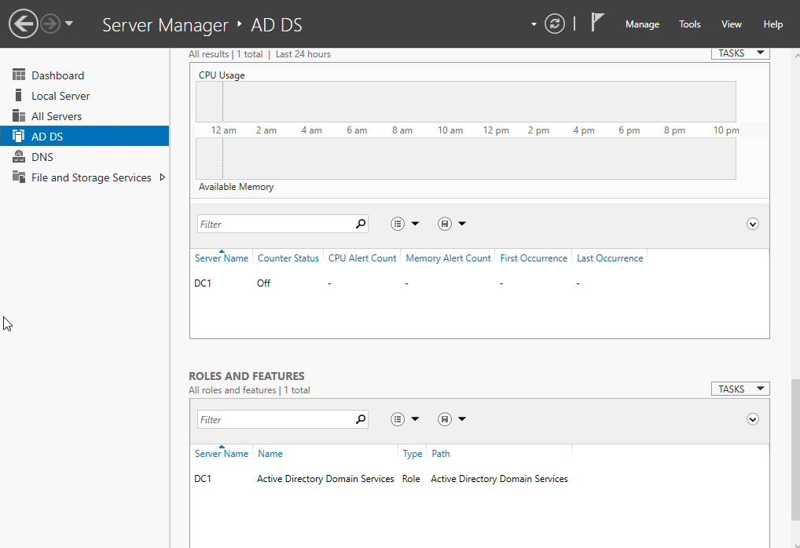
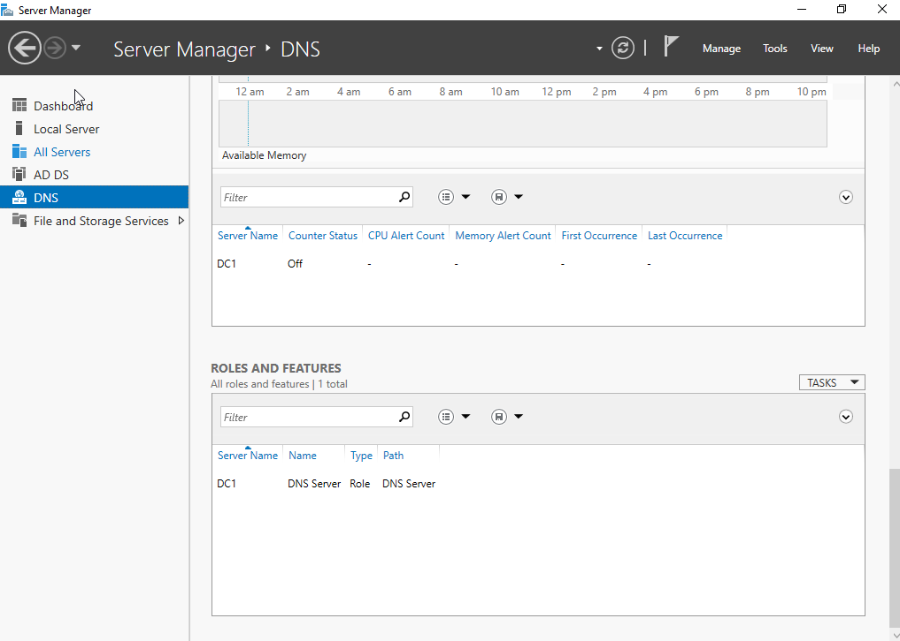
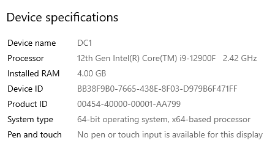
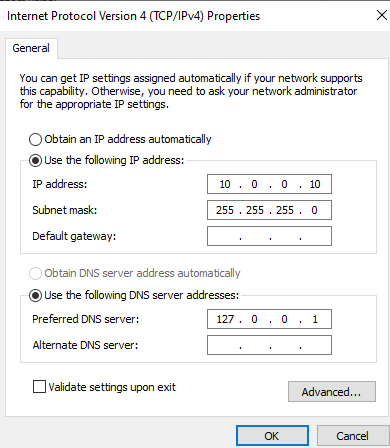
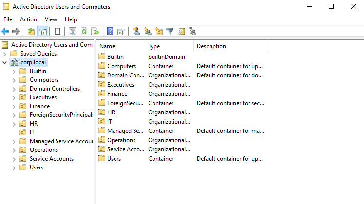
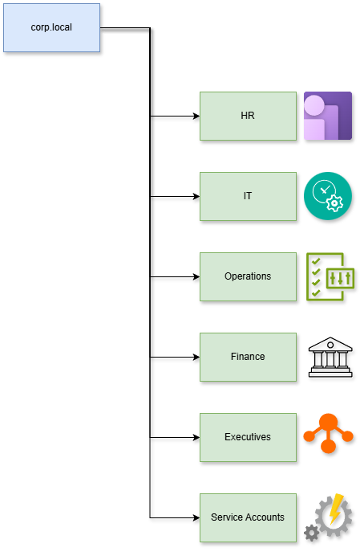
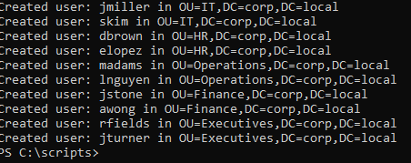

# Active Directory Home Lab — Setup Guide (Day 1)

## Overview

This document explains what was completed on Day 1 of setting up the Active Directory home lab. 

---

## What Was Installed

### Virtual Machine Setup

A Windows Server 2022 virtual machine was created in VirtualBox. The machine was configured with the following basic settings:

* 4 GB of RAM
* 2 CPU cores
* 60 GB of storage
* A network adapter using an Internal Network

Windows Server 2022 was installed on this VM, and the Administrator account was used for initial configuration.

### Server Roles

The following Windows Server roles were installed:

* Active Directory Domain Services (AD DS)
* DNS Server

These are the two core components needed for creating and managing a Windows-based domain.

---

## Day 1 Summary

Below is a clear outline of everything completed on the first day.

### 1. Installed Windows Server 2022

* Created the VM in VirtualBox
* Mounted the Windows Server ISO
* Completed the operating system installation
* Signed in as Administrator for the first-time setup

### 2. Configured Static Networking

* Opened the Network Connections panel
* Assigned a static IPv4 address
* Set the DNS server to the server’s own IP
* Verified that the adapter was active and properly configured

A static IP is required so the domain controller does not change addresses when rebooted.

### 3. Installed AD DS and DNS

* Opened Server Manager
* Added the AD DS and DNS roles
* Completed the role installation

### 4. Promoted the Server to a Domain Controller

* Created a new forest
* Specified a domain name
* Allowed the server to restart after domain promotion

After this step, the server became “DC1,” the first domain controller in the environment.

### 5. Took Documentation Screenshots

All required screenshots were captured and stored for uploading to GitHub.

---

## Screenshots

### Server Manager Home



### AD DS Roles Installed



### DNS Server Roles Installed



### DC1 System Information



### Static IP Configuration



---

# Active Directory Home Lab — Setup Guide (Day 2)

## Overview

This document explains what was completed on Day 2 of setting up the Active Directory home lab. Day 2 focused on organizational structure and automated user creation.

---

## What Was Built

### Organizational Unit Structure

A clean, realistic folder structure was created for users, computers, and security groups. Inside Active Directory Users and Computers, the following OU structure was established:

```
corp.local
 └── _CORP
     ├── Groups
     ├── Users
     │     ├── Operations
     │     ├── HR
     │     ├── IT
     │     ├── Finance
     │     └── Sales
     └── Computers
           ├── Workstations
           └── Servers
```

Each OU was created by right-clicking the domain in Active Directory Users and Computers, selecting New → Organizational Unit, and naming it appropriately. This structure provides a logical separation of resources and makes management easier.

### Automated User Creation

A PowerShell automation script was created to bulk-create users in specific OUs. This script reads from a CSV file and automatically provisions users with proper attributes and secure passwords.

---

## Day 2 Summary

Below is a clear outline of everything completed on the second day.

### 1. Created Organizational Unit Structure

* Opened Active Directory Users and Computers
* Created the _CORP parent OU under the domain
* Created Groups, Users, and Computers OUs under _CORP
* Created department-specific OUs under Users (Operations, HR, IT, Finance, Sales)
* Created Workstations and Servers OUs under Computers
* Verified the complete structure was in place

This OU structure provides a realistic organizational layout that mirrors how enterprises typically organize their Active Directory environments.

### 2. Developed User Creation Script

* Developed a PowerShell script `create_users.ps1` to automate user creation
* Set up username generation using first initial and last name format
* Implemented secure password assignment
* Added error handling for failed user creation attempts

The CSV file format used:

```
FirstName,LastName,Department
Laura,Nguyen,Operations
Michael,Adams,Sales
```

### 3. Executed User Creation Script

* Placed the CSV and PowerShell script files in `C:\scripts\`
* Opened PowerShell as Administrator
* Set execution policy to allow script execution
* Ran the script to create all users
* Verified users were created in the correct department OUs

The script successfully created users in their respective department OUs, with each user account enabled and ready for use.

### 4. Verified User Creation

* Opened Active Directory Users and Computers
* Checked each department OU to confirm users were present
* Verified user properties were correctly set
* Confirmed no errors occurred during the creation process

All users were successfully created and placed in their appropriate organizational units.

### 5. Took Documentation Screenshots

All required screenshots were captured and stored for uploading to GitHub.

---

## User Creation Script Details

The PowerShell script `create_users.ps1` performs the following operations:

* Imports the ActiveDirectory module
* Generates usernames using the format: first initial + last name (lowercase)
* Creates the appropriate OU path based on department
* Assigns a secure password to each user
* Creates the AD user account with all required attributes
* Enables the user account immediately
* Logs each created user to the console
* Handles errors gracefully with try-catch blocks

The script was placed in `C:\scripts\` along with the `users.csv` file, and executed with administrator privileges after setting the execution policy.

---

## Screenshots

### OU Structure



### AD Structure Diagram



### OU Users Folders


### User Creation Script Run



### AD Users Populated


### Individual User Properties


